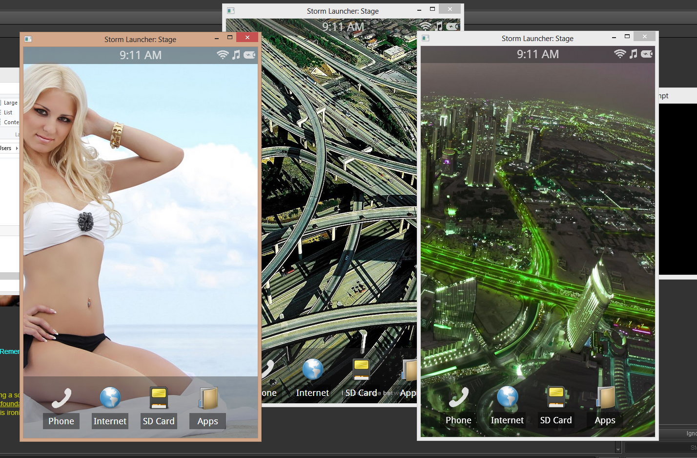

storm
=====

html5 application launcher ui

download for your phone @ nowhere.
presently testing is run with https://github.com/rogerwang/node-webkit
which you can put somewhere in your path and then simply run:
	
	cd ../
	nw storm
	
how it looks:
=====

	
chemist
====

storm has a special framework for its own gui and library, this is called chemist
chemist provides a basic api inside of its directory you can use

	chemist.define('my.package.name');
	my.package.name.someclass = function() { ... }
	
and to import later

	chemist.import('my.package.name.someclass');
	
will add the js file to the head and the lib will be available after bootstrap